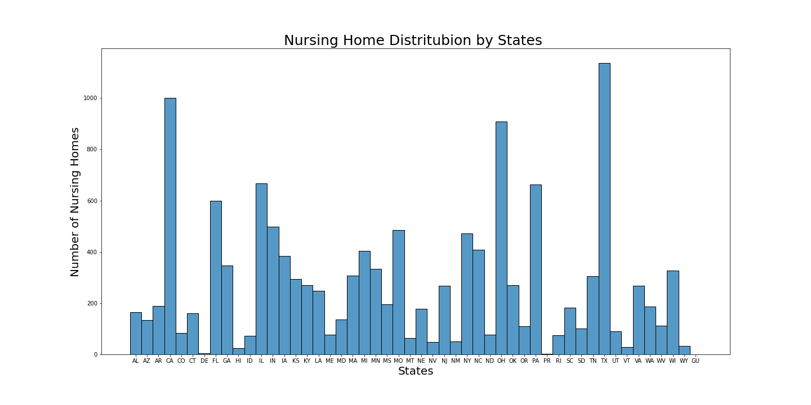
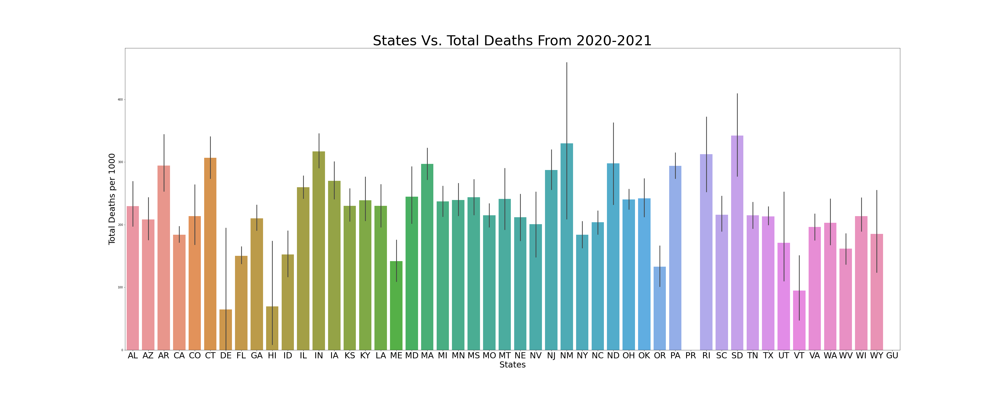
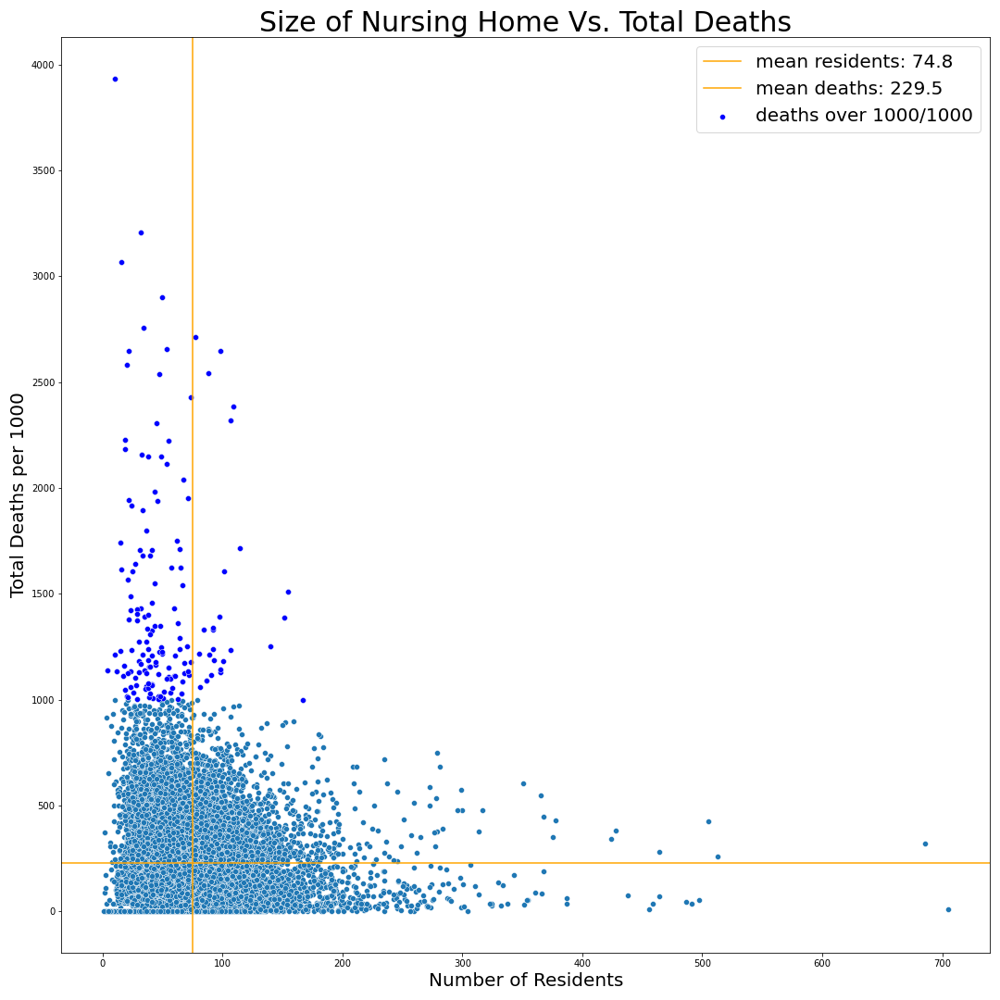
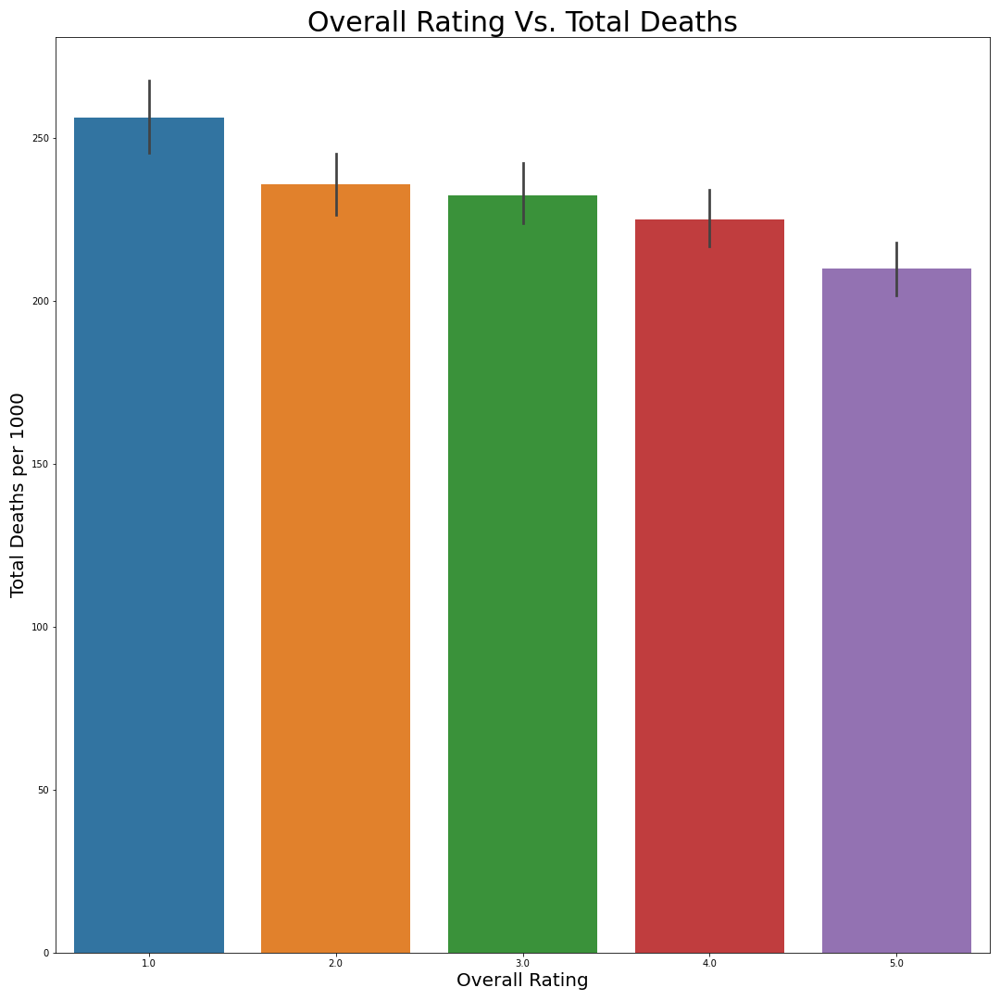
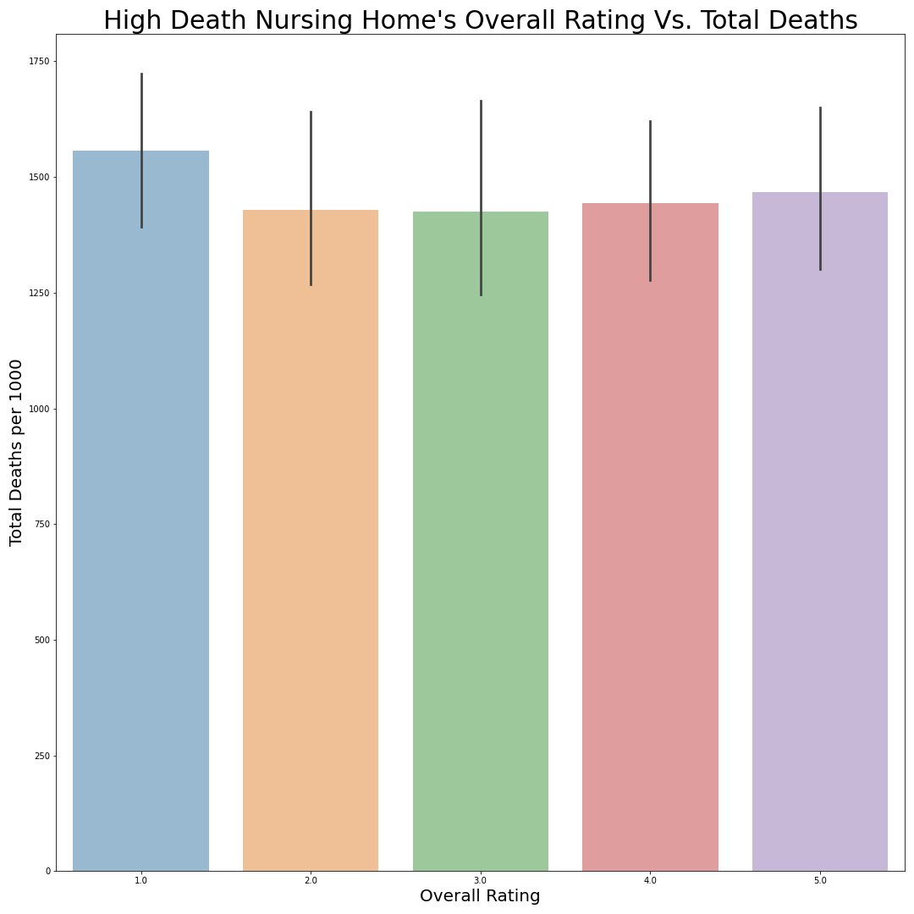
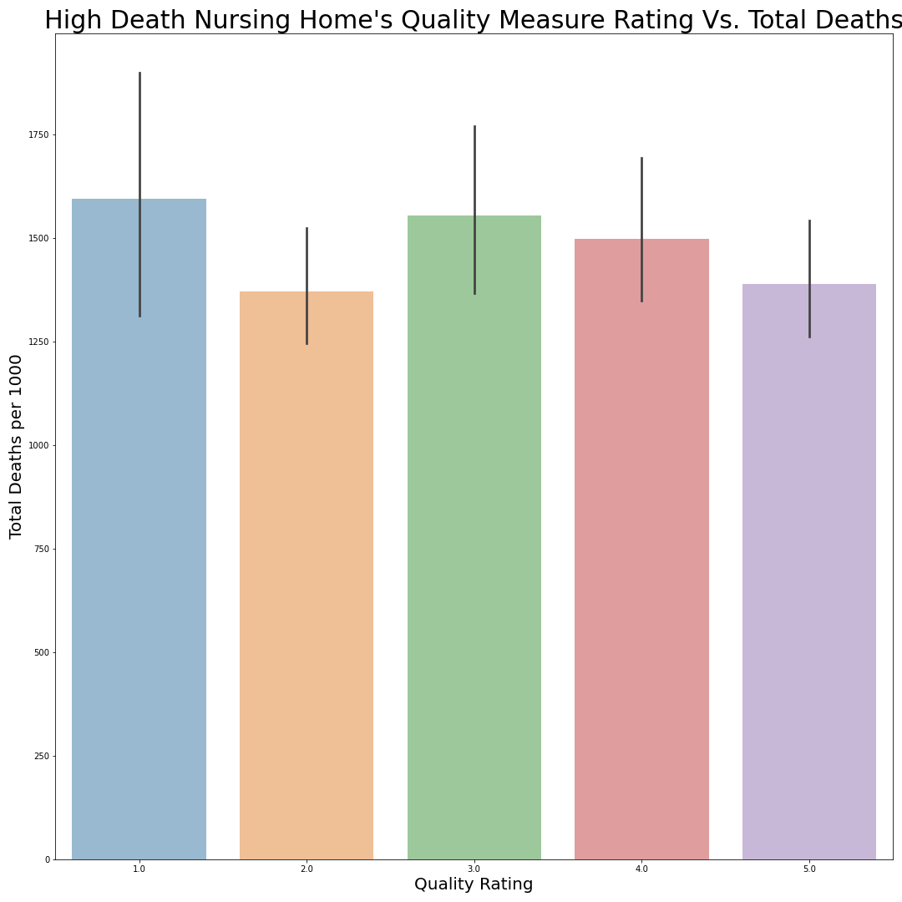
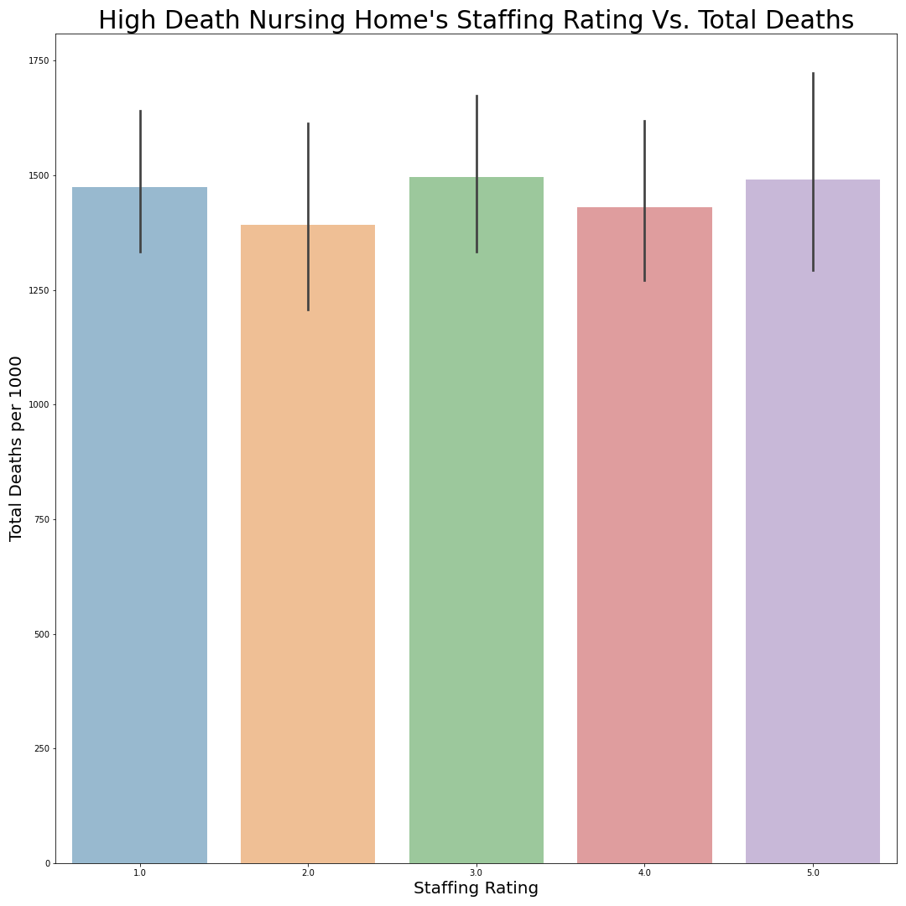
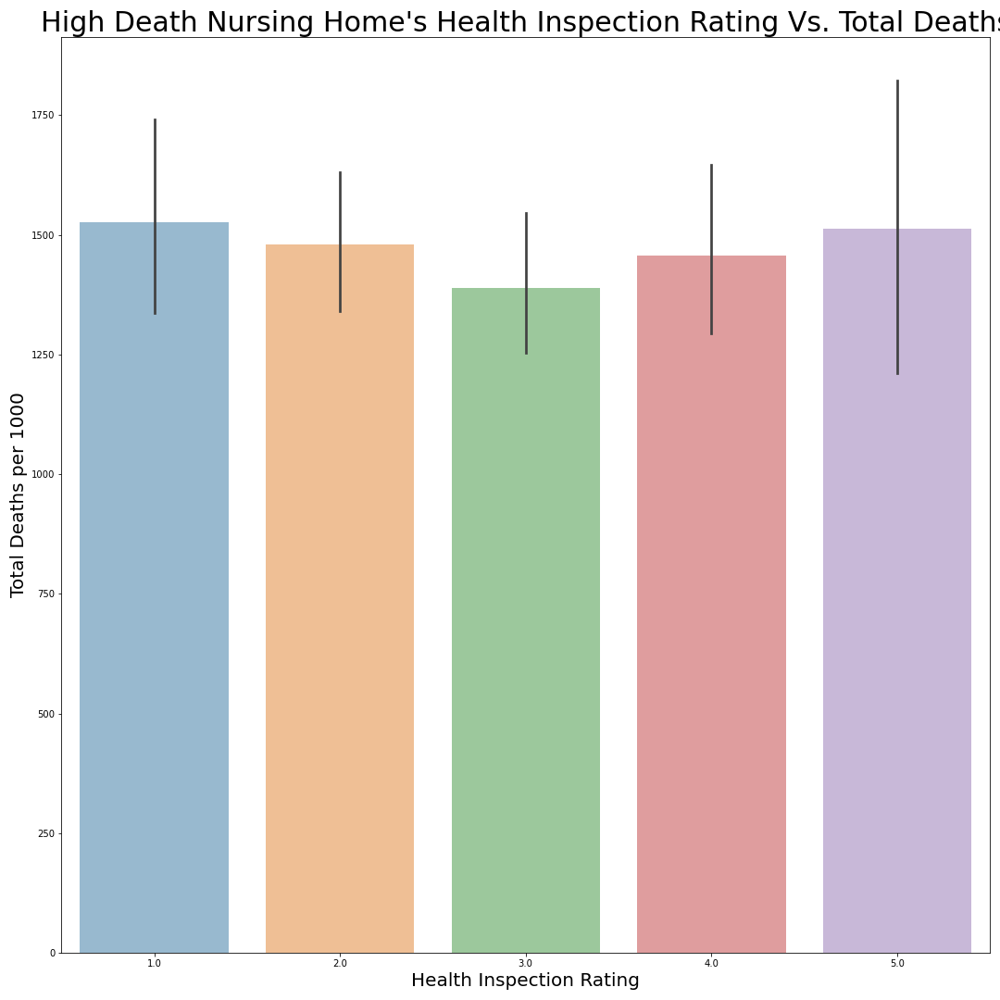
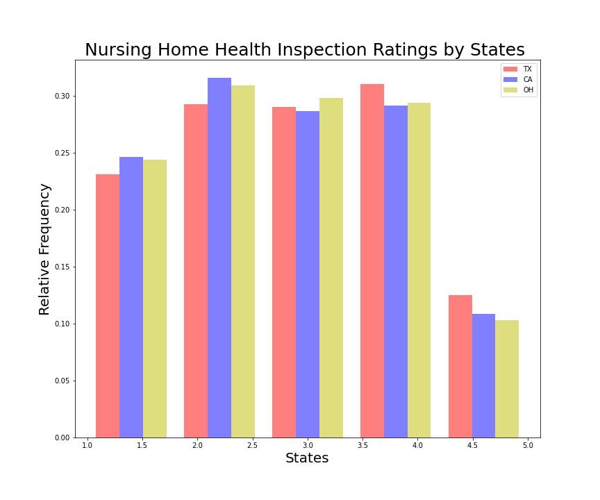
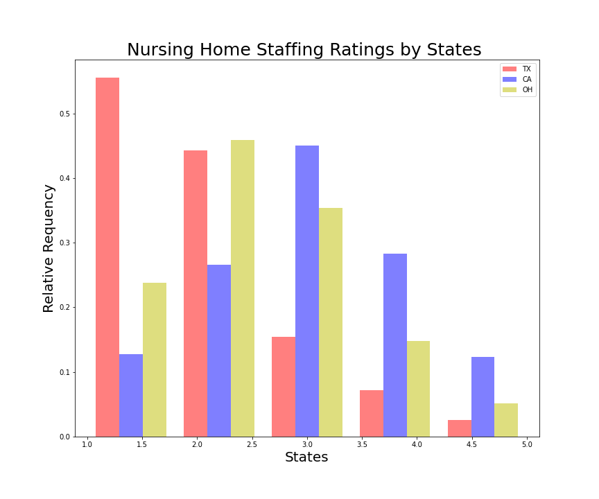

# **Project 5: Predicting Covid Deaths in Nursing Homes**
### By: Shirley Lin, Jamie Squires, Sam Waldner

# Executive Summary

## Background & Overview

The communal nature of nursing homes puts elderly and vulnerable residents at an increased risk of infection and severe illness from COVID-19. According to the New York Times, in the US, long-term care facilities accounted for almost 40% of total COVID deaths and 5% of all cases in 2020. 

Despite this problem, US Government oversight is fairly comprehensive in how it scores and evaluates nursing homes. However, they have yet to incorporate any COVID related data into these scores. Currently, Nursing homes are given a rating between one and five stars. These stars are based on three primary factors:

1. Staffing Rating - Includes number of hours staff work, the number and type of staff, etc.
2. Health Inspection Rating - Includes health violations, fines, length of time to fix violations, etc.
3. Quality Measure Rating - Includes marked improvement for residents of a period of time based on whether they are long or short care patients as well as some of the more common treatments a resident might receive, such as catheter removal, etc.

This star rating system is built with the intent to help people choose a nursing home, and is accompanied by a 30-page technical user manual. States are graded on a curve within each state, or as the manual puts it, "CMS bases Five-Star quality ratings in the health inspection domain on the relative performance of facilities within a state...The top 10 percent (with the lowest health inspection weighted scores) in each state receive ahealth inspection rating of five stars." Therefore there is potential for a wide margin of difference between 5-star homes in different states.

## Problem Statement

This project will aim to predict COVID-related deaths in nursing homes based on a wide variety of CMS provided features including but not limited to their official 5-Star Rating and it's component parts. We hypothesize that because these factors are indicative of the overall safety, sanitation, and operational efficiency of a nursing home, they should help represent and understand COVID related incidents since the virus is spread through known health factors. Any information relating to COVID is an important decision-making tool for people looking to find a safe nursing home for their loved ones, and so based on our results we will make recommendations on the nursing home selection process.

* Can we create a reliable model to predict Covid-19 deaths amongst nursing homes?

* Which features are relatively most important in determining covid deaths?

## Data Dictionary

**Data Sources**

[Covid Nursing Home Data](https://data.cms.gov/covid-19/covid-19-nursing-home-data)

[Covid Vaccination Data](https://data.cms.gov/provider-data/dataset/avax-cv19)

[Provider Data](https://data.cms.gov/provider-data/dataset/4pq5-n9py)

[Provider Financial Data](https://data.cms.gov/provider-compliance/cost-report/skilled-nursing-facility-cost-report)

| Feature                                                         | Type  | Dummy Variable | Description                                                                                                                                                                                                                                                                                                                                                                                                                                                                                      |
|-----------------------------------------------------------------|-------|----------------|--------------------------------------------------------------------------------------------------------------------------------------------------------------------------------------------------------------------------------------------------------------------------------------------------------------------------------------------------------------------------------------------------------------------------------------------------------------------------------------------------|
| total_deaths_per_1000                                           | float | 0              | Aggregated 2020 and 2021 covid deaths per 1000 residents per nursing home                                                                                                                                                                                                                                                                                                                                                                                                                        |
| number_of_certified_beds                                        | int   | 0              | Number of federally certified beds                                                                                                                                                                                                                                                                                                                                                                                                                                                               |
| average_number_of_residents_per_day                             | float | 0              | Average number of residents per day                                                                                                                                                                                                                                                                                                                                                                                                                                                              |
| provider_resides_in_hospital                                    | int   | 0              | Binary indicator if the provider resides in a hospital                                                                                                                                                                                                                                                                                                                                                                                                                                           |
| date_first_approved_to_provide_medicare_and_medicaid_services   | int   | 0              | Date first approved to provide medicare/medicaid services                                                                                                                                                                                                                                                                                                                                                                                                                                        |
| continuing_care_retirement_community                            | int   | 0              | binary indicator if the provider is a continuing care retirement   community                                                                                                                                                                                                                                                                                                                                                                                                                     |
| abuse_icon                                                      | int   | 0              | Cited for abuse or neglect at harm level or above on survey cycle 1  (Scope/severity G or greater) or cited for   abuse or neglect at potential harm level (Scope/Severity D or above) on both   survey cycles 1 and 2*                                                                                                                                                                                                                                                                          |
| most_recent_health_inspection_more_than_2_years_ago             | int   | 0              | binary indicator if the most recent health inspection was more than 2   years ago                                                                                                                                                                                                                                                                                                                                                                                                                |
| provider_changed_ownership_in_last_12_months                    | int   | 0              | binary indicator if the nursing home provider changed ownership in the   last 12 months                                                                                                                                                                                                                                                                                                                                                                                                          |
| automatic_sprinkler_systems_in_all_required_areas               | float | 0              | binary indicator if automatic sprinkler system required in all areas                                                                                                                                                                                                                                                                                                                                                                                                                             |
| overall_rating                                                  | float | 0              | Overall rating score from 1 to 5                                                                                                                                                                                                                                                                                                                                                                                                                                                                 |
| health_inspection_rating                                        | float | 0              | Health inspection scores ranging from 1 to 5, The health inspection   rating contains the 3 most recent health inspections and investigations due   to complaints.  This information is   gathered by trained, objective inspectors who go onsite to the nursing home   and follow a specific process to determine the extent to which a nursing home   has met Medicaid and Medicare’s minimum quality requirements.  The most recent survey findings are   weighted more than the prior year.* |
| qm_rating                                                       | float | 0              | Quality measure rating from 1 to 5, The quality measure rating has   information on 15 different physical and clinical measures for nursing home   residents.   The QMs offer information   about how well nursing homes are caring for their residents’ physical and   clinical needs.                                                                                                                                                                                                          |
| staffing_rating                                                 | float | 0              | Staffing rating from 1 to 5, has information about the number of hours of   care provided on average to each resident each day by nursing staff*                                                                                                                                                                                                                                                                                                                                                 |
| rn_staffing_rating                                              | float | 0              | RN Staffing Rating from 1 to 5, has information about the number of hours   of care provided on average to each resident each day by nursing staff*                                                                                                                                                                                                                                                                                                                                              |
| reported_nurse_aide_staffing_hours_per_resident_per_day         | float | 0              | self reported nurse aid staffing hours per resident per day                                                                                                                                                                                                                                                                                                                                                                                                                                      |
| reported_lpn_staffing_hours_per_resident_per_day                | float | 0              | self reported LPN staffing hours per resident per day                                                                                                                                                                                                                                                                                                                                                                                                                                            |
| reported_rn_staffing_hours_per_resident_per_day                 | float | 0              | self reported RN staffing hours per resident per day                                                                                                                                                                                                                                                                                                                                                                                                                                             |
| reported_licensed_staffing_hours_per_resident_per_day           | float | 0              | self reported licensed staffing hours per resident per day (RN + LPN)                                                                                                                                                                                                                                                                                                                                                                                                                            |
| reported_total_nurse_staffing_hours_per_resident_per_day        | float | 0              | self reported total nurse staffing hours per resident per day                                                                                                                                                                                                                                                                                                                                                                                                                                    |
| reported_physical_therapist_staffing_hours_per_resident_per_day | float | 0              | self reported physical therapist staffing hours per resident per day                                                                                                                                                                                                                                                                                                                                                                                                                             |
| adjusted_nurse_aide_staffing_hours_per_resident_per_day         | float | 0              | adjusted nurse aide staffing hours per resident per day                                                                                                                                                                                                                                                                                                                                                                                                                                          |
| adjusted_lpn_staffing_hours_per_resident_per_day                | float | 0              | adjusted LPN staffing hours per resident per day                                                                                                                                                                                                                                                                                                                                                                                                                                                 |
| adjusted_rn_staffing_hours_per_resident_per_day                 | float | 0              | adjusted RN staffing hours per resident per day                                                                                                                                                                                                                                                                                                                                                                                                                                                  |
| adjusted_total_nurse_staffing_hours_per_resident_per_day        | float | 0              | adjusted total nurse staffing hours per resident per day                                                                                                                                                                                                                                                                                                                                                                                                                                         |
| total_weighted_health_survey_score                              | float | 0              | total weighted health survey score for 3 cycles                                                                                                                                                                                                                                                                                                                                                                                                                                                  |
| number_of_facility_reported_incidents                           | int   | 0              | Number of times in the past 3 years that a facility-reported issue   resulted in a citation                                                                                                                                                                                                                                                                                                                                                                                                      |
| number_of_substantiated_complaints                              | int   | 0              | Number of Complaints in the past 3 years that resulted in a citation                                                                                                                                                                                                                                                                                                                                                                                                                             |
| number_of_citations_from_infection_control_inspections          | float | 0              | Number of citations from infectjion control inspections in the past 3   years                                                                                                                                                                                                                                                                                                                                                                                                                    |
| number_of_fines                                                 | int   | 0              | Number of Fines                                                                                                                                                                                                                                                                                                                                                                                                                                                                                  |
| total_amount_of_fines_in_dollars                                | float | 0              | Total Amount of Fines in Dollars                                                                                                                                                                                                                                                                                                                                                                                                                                                                 |
| number_of_payment_denials                                       | int   | 0              | Number of Payment Denials                                                                                                                                                                                                                                                                                                                                                                                                                                                                        |
| total_number_of_penalties                                       | int   | 0              | Total Number of Penalties                                                                                                                                                                                                                                                                                                                                                                                                                                                                        |
| percent_vaccinated_residents                                    | float | 0              | Percentage of vaccinated residents (as of 12/7/21)                                                                                                                                                                                                                                                                                                                                                                                                                                               |
| percent_vaccinated_healthcare_personnel                         | float | 0              | Percentage of vaccinated healthcare personnel (as of 12/7/21)                                                                                                                                                                                                                                                                                                                                                                                                                                    |
| rural_versus_urban                                              | float | 0              | Binary indicator if the location is rural or urban                                                                                                                                                                                                                                                                                                                                                                                                                                               |
| wage-related_costs_(core)                                       | float | 0              | Total core wage-related costs from financial data                                                                                                                                                                                                                                                                                                                                                                                                                                                |
| salaries,_wages,_and_fees_payable                               | float | 0              | actual liabilities of the facility for salaries and wages/fees payable                                                                                                                                                                                                                                                                                                                                                                                                                           |
| total_liabilities                                               | float | 0              | Sum of total current liabilities and long term liabilities                                                                                                                                                                                                                                                                                                                                                                                                                                       |
| net_patient_revenue                                             | float | 0              | Net patient revenue per provider                                                                                                                                                                                                                                                                                                                                                                                                                                                                 |
| net_income_from_service_to_patients                             | float | 0              | Net income from service to patients (Net Patient Revenue - Operating   Expenses)                                                                                                                                                                                                                                                                                                                                                                                                                 |
| net_income                                                      | float | 0              | Net income per provider                                                                                                                                                                                                                                                                                                                                                                                                                                                                          |
| provider_state_ar                                               | int   | 1              | Dummy variable for nursing home state                                                                                                                                                                                                                                                                                                                                                                                                                                                            |
| provider_state_az                                               | int   | 1              | Dummy variable for nursing home state                                                                                                                                                                                                                                                                                                                                                                                                                                                            |
| provider_state_ca                                               | int   | 1              | Dummy variable for nursing home state                                                                                                                                                                                                                                                                                                                                                                                                                                                            |
| provider_state_co                                               | int   | 1              | Dummy variable for nursing home state                                                                                                                                                                                                                                                                                                                                                                                                                                                            |
| provider_state_ct                                               | int   | 1              | Dummy variable for nursing home state                                                                                                                                                                                                                                                                                                                                                                                                                                                            |
| provider_state_de                                               | int   | 1              | Dummy variable for nursing home state                                                                                                                                                                                                                                                                                                                                                                                                                                                            |
| provider_state_fl                                               | int   | 1              | Dummy variable for nursing home state                                                                                                                                                                                                                                                                                                                                                                                                                                                            |
| provider_state_ga                                               | int   | 1              | Dummy variable for nursing home state                                                                                                                                                                                                                                                                                                                                                                                                                                                            |
| provider_state_gu                                               | int   | 1              | Dummy variable for nursing home state                                                                                                                                                                                                                                                                                                                                                                                                                                                            |
| provider_state_hi                                               | int   | 1              | Dummy variable for nursing home state                                                                                                                                                                                                                                                                                                                                                                                                                                                            |
| provider_state_ia                                               | int   | 1              | Dummy variable for nursing home state                                                                                                                                                                                                                                                                                                                                                                                                                                                            |
| provider_state_id                                               | int   | 1              | Dummy variable for nursing home state                                                                                                                                                                                                                                                                                                                                                                                                                                                            |
| provider_state_il                                               | int   | 1              | Dummy variable for nursing home state                                                                                                                                                                                                                                                                                                                                                                                                                                                            |
| provider_state_in                                               | int   | 1              | Dummy variable for nursing home state                                                                                                                                                                                                                                                                                                                                                                                                                                                            |
| provider_state_ks                                               | int   | 1              | Dummy variable for nursing home state                                                                                                                                                                                                                                                                                                                                                                                                                                                            |
| provider_state_ky                                               | int   | 1              | Dummy variable for nursing home state                                                                                                                                                                                                                                                                                                                                                                                                                                                            |
| provider_state_la                                               | int   | 1              | Dummy variable for nursing home state                                                                                                                                                                                                                                                                                                                                                                                                                                                            |
| provider_state_ma                                               | int   | 1              | Dummy variable for nursing home state                                                                                                                                                                                                                                                                                                                                                                                                                                                            |
| provider_state_md                                               | int   | 1              | Dummy variable for nursing home state                                                                                                                                                                                                                                                                                                                                                                                                                                                            |
| provider_state_me                                               | int   | 1              | Dummy variable for nursing home state                                                                                                                                                                                                                                                                                                                                                                                                                                                            |
| provider_state_mi                                               | int   | 1              | Dummy variable for nursing home state                                                                                                                                                                                                                                                                                                                                                                                                                                                            |
| provider_state_mn                                               | int   | 1              | Dummy variable for nursing home state                                                                                                                                                                                                                                                                                                                                                                                                                                                            |
| provider_state_mo                                               | int   | 1              | Dummy variable for nursing home state                                                                                                                                                                                                                                                                                                                                                                                                                                                            |
| provider_state_ms                                               | int   | 1              | Dummy variable for nursing home state                                                                                                                                                                                                                                                                                                                                                                                                                                                            |
| provider_state_mt                                               | int   | 1              | Dummy variable for nursing home state                                                                                                                                                                                                                                                                                                                                                                                                                                                            |
| provider_state_nc                                               | int   | 1              | Dummy variable for nursing home state                                                                                                                                                                                                                                                                                                                                                                                                                                                            |
| provider_state_nd                                               | int   | 1              | Dummy variable for nursing home state                                                                                                                                                                                                                                                                                                                                                                                                                                                            |
| provider_state_ne                                               | int   | 1              | Dummy variable for nursing home state                                                                                                                                                                                                                                                                                                                                                                                                                                                            |
| provider_state_nj                                               | int   | 1              | Dummy variable for nursing home state                                                                                                                                                                                                                                                                                                                                                                                                                                                            |
| provider_state_nm                                               | int   | 1              | Dummy variable for nursing home state                                                                                                                                                                                                                                                                                                                                                                                                                                                            |
| provider_state_nv                                               | int   | 1              | Dummy variable for nursing home state                                                                                                                                                                                                                                                                                                                                                                                                                                                            |
| provider_state_ny                                               | int   | 1              | Dummy variable for nursing home state                                                                                                                                                                                                                                                                                                                                                                                                                                                            |
| provider_state_oh                                               | int   | 1              | Dummy variable for nursing home state                                                                                                                                                                                                                                                                                                                                                                                                                                                            |
| provider_state_ok                                               | int   | 1              | Dummy variable for nursing home state                                                                                                                                                                                                                                                                                                                                                                                                                                                            |
| provider_state_or                                               | int   | 1              | Dummy variable for nursing home state                                                                                                                                                                                                                                                                                                                                                                                                                                                            |
| provider_state_pa                                               | int   | 1              | Dummy variable for nursing home state                                                                                                                                                                                                                                                                                                                                                                                                                                                            |
| provider_state_pr                                               | int   | 1              | Dummy variable for nursing home state                                                                                                                                                                                                                                                                                                                                                                                                                                                            |
| provider_state_ri                                               | int   | 1              | Dummy variable for nursing home state                                                                                                                                                                                                                                                                                                                                                                                                                                                            |
| provider_state_sc                                               | int   | 1              | Dummy variable for nursing home state                                                                                                                                                                                                                                                                                                                                                                                                                                                            |
| provider_state_sd                                               | int   | 1              | Dummy variable for nursing home state                                                                                                                                                                                                                                                                                                                                                                                                                                                            |
| provider_state_tn                                               | int   | 1              | Dummy variable for nursing home state                                                                                                                                                                                                                                                                                                                                                                                                                                                            |
| provider_state_tx                                               | int   | 1              | Dummy variable for nursing home state                                                                                                                                                                                                                                                                                                                                                                                                                                                            |
| provider_state_ut                                               | int   | 1              | Dummy variable for nursing home state                                                                                                                                                                                                                                                                                                                                                                                                                                                            |
| provider_state_va                                               | int   | 1              | Dummy variable for nursing home state                                                                                                                                                                                                                                                                                                                                                                                                                                                            |
| provider_state_vt                                               | int   | 1              | Dummy variable for nursing home state                                                                                                                                                                                                                                                                                                                                                                                                                                                            |
| provider_state_wa                                               | int   | 1              | Dummy variable for nursing home state                                                                                                                                                                                                                                                                                                                                                                                                                                                            |
| provider_state_wi                                               | int   | 1              | Dummy variable for nursing home state                                                                                                                                                                                                                                                                                                                                                                                                                                                            |
| provider_state_wv                                               | int   | 1              | Dummy variable for nursing home state                                                                                                                                                                                                                                                                                                                                                                                                                                                            |
| provider_state_wy                                               | int   | 1              | Dummy variable for nursing home state                                                                                                                                                                                                                                                                                                                                                                                                                                                            |
| ownership_type_government                                       | int   | 1              | Dummy variable for nursing home ownership type (government owned)                                                                                                                                                                                                                                                                                                                                                                                                                                |
| ownership_type_non_profit                                       | int   | 1              | Dummy variable for nursing home ownership type (non-profit owned)                                                                                                                                                                                                                                                                                                                                                                                                                                |
| with_a_resident_and_family_council_family                       | int   | 1              | Dummy variable for council type (family council)                                                                                                                                                                                                                                                                                                                                                                                                                                                 |
| with_a_resident_and_family_council_none                         | int   | 1              | Dummy variable for council type (none)                                                                                                                                                                                                                                                                                                                                                                                                                                                           |
| with_a_resident_and_family_council_resident                     | int   | 1              | Dummy variable for council type (resident council)                                                                                                                                                                                                                                                                                                                                                                                                                                               |

Note: * indicates that definitions were collected from [Guide to Interpreting Provider Scores](https://www.cms.gov/Medicare/Provider-Enrollment-and-Certification/CertificationandComplianc/FSQRS)

## EDA

- The top three states with the most nursing homes participating with Medicare and Medicaid are Texas, California, and Ohio.

- The top three states with the highest mean death rates are South Dakota, New Mexico, and Indiana.

- The scatter plot of average resident's per day in nursing homes Vs. Total deaths per 1000 residents suggest no significant correlations between the two. Nursing homes with high casualties are distributed around the nation's mean.

- Country's overall ratings of nursing homes suggest an inverse relationship between the ratings and the number of deaths per 1000 in nursing homes. 

- The Overall ratings, quality measure ratings, health inspection ratings, and staffing ratings have no strong correlation with the number of deaths in nursing homes. 

- Inconsistency in ratings was seen in the top three states with the most nursing homes. 

# Findings & Recommendations:

### Modeling Results

|           Model          |  RMSE  |   MAE  |
|:------------------------:|:------:|:------:|
| Linear Regression        | 237.83 | 165.90 |
| XGBoost                  | 238.24 | 165.70 |
| Random Forests Regressor | 240.17 | 169.15 |
| Bagging Regressor        | 240.66 | 169.47 |
| KNN Regressor            | 241.54 | 168.20 |
| PCA                      | 244.06 | 172.07 |
| Decision Tree Regressor  | 245.58 | 172.42 |
| Neural Network           | 248.98 | 164.11 |
| AdaBoost Regressor       | 419.87 | 362.00 |

Baseline RMSE: 242.81

Linear Regression Results:

|   Model  |  RMSE  |   MAE  |  R2  |
|:--------:|:------:|:------:|:----:|
| Training | 233.62 | 162.73 | 6.6% |
| Testing  | 237.83 | 165.90 | 6.5% |

### Modeling Findings:

Based on the modeling results above, we can see that our models performed very poorly in being able to explain the variability in deaths per 1000 residents. 5 models performed slightly better than the baseline or null model in terms of RMSE (Linear Regression, XGBoost, Random Forests Regressor, Bagging Regressor, and KNN Regressor). The simple linear regression performed the best, with a testing RMSE of 237.83. However, our R2 score was only 6.5%. Thus, we can conclude that the nursing home provider data was a poor predictor of covid deaths, as our best model could only explain 6.5% of the variability in covid deaths.

### Recommendation & Conclusion:

Because the spread of COVID is a known factor, we thought that we would be able to use the Governments health and operational data to predict COVID deaths and cases in nursing homes. We found that this was not the case. Our best model was only able to predict ~7% of the variance, meaning it had very low prediction capability. As we delved into the data we found out why this might be the case.

Each state has different regulatory and reporting measures in place that lead to different standards of care, sanitation, and operational practices. Because of this (or despite it), the Federal government uses a sliding scale to determine the quality of these homes. No matter what, it gives the top rated 10% five stars and measures the other size on percent of population as well. This can lead to extreme variance in COVID incidents and health standards. In other words, a 5-star nursing home in West Virgina can be far more effective and rigorous in its health practices than a 5-star home in California. In fact, two independent studies were done in California and West Virgina respectively, and they came to different conclusions. West Virgina found that all Star related features were directly related while the California study found, "CMS star ratings can serve as proxy indicators for COVID-19 outbreak risk; health departments could use them to identify priority nursing homes and inform the allocation of infection prevention and control resources." In the California study however, the maximum infection rate seems to be higher in facilities that have a higher QM and Staffing rating.

In short, we found that while much of the governemnt data and oversight in regulation and rating is effective at understanding quality of care and does, to some extent, show a pattern when compared to COVID incidents, it is far from perfect. It does not include or take into account past COVID data, it doesn't maintain the same standard across states, the star system is convoluted 
and hard to understand, and finally, much of the data that is used to make these scores is faulty in part due to self-reporting errors.

In order to address these issues, a more standard national star-rating system should be implemented regardless of state restrictions. Many of the metrics and measures used are clearly not as effective as they could be due to the difficulty they have in predicting viral outbreaks and deaths, so these should also be reassesed. Finally, as it is very relevant in the consumer decision making process, past and current COVID data should be considered as a weighing factor in the star ratings, which are intended to make the choice more efficient and user-friendly.

With that in mind we have constructed a prototype web-app concept through Streamlit. This application serves a similar function to the Medicare nursing home comparison tool, but aims to alleviate some of the more confusing and incomplete aspects of it. 

Specifically, it includes:

- a short FAQ that breaks down different elements the nursing homes star rating
- provides recommended nursing homes based on region
- includes easily apparent COVID data based on most reacent year
- avoids conflicting score ratings that may cause user confusion such as a nursing home being flagged for elder abuse while having a 4-star QM rating.

**Sources Cited:**

[Guide to Interpreting Provider Scores](https://www.cms.gov/Medicare/Provider-Enrollment-and-Certification/CertificationandComplianc/FSQRS)

[Covid Nursing Home Data](https://data.cms.gov/covid-19/covid-19-nursing-home-data)

[Covid Vaccination Data](https://data.cms.gov/provider-data/dataset/avax-cv19)

[Provider Data](https://data.cms.gov/provider-data/dataset/4pq5-n9py)

[Provider Financial Data](https://data.cms.gov/provider-compliance/cost-report/skilled-nursing-facility-cost-report)

[NY Times Covid Information](https://www.nytimes.com/2020/12/31/opinion/sunday/covid-nursing-homes.html )

[Predicting COVID-19 at skilled nursing
facilities in California](https://bmjopenquality.bmj.com/content/bmjqir/10/1/e001099.full.pdf)

[CMS Quality Ratings and COVID-19 Outbreaks in West Virginia Nursing Homes](https://www.ncbi.nlm.nih.gov/pmc/articles/PMC7498166/)
